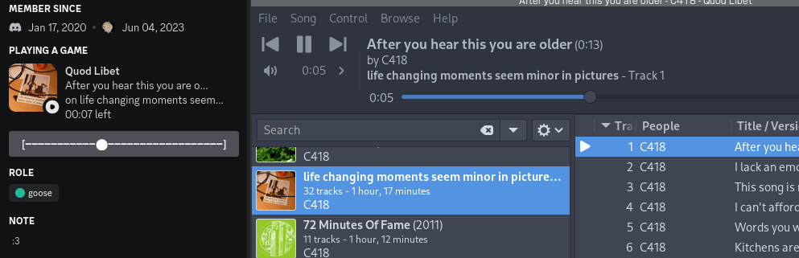
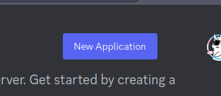
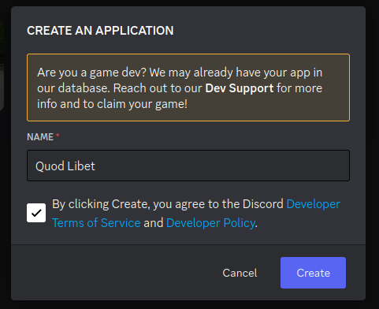
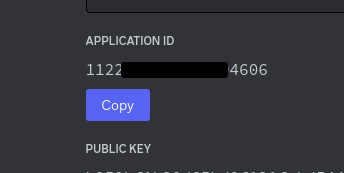
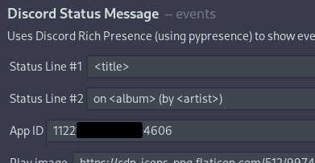

# a discord rich presence plugin for [quod libet](https://github.com/quodlibet/quodlibet)


this is a version of [quod libet's discord rpc plugin](https://github.com/quodlibet/quodlibet/blob/main/quodlibet/ext/events/discord_status.py) that i (heavily) modified to add time left, a slider using a button ~~and album art~~

i can agree that this is spaghetti code, i am not a great programmer


## disclaimers:
as far as i know, **this code only works on linux** (as the original plugin purposefully throws an error if it detects macos/windows), though i haven't tested it on windows as i am too lazy

i also haven't tested it well enough and it could crash; i know nobody will use this but if it does let me know by submitting an issue

## faq:
#### why does my player freeze whenever i choose a song?
this is due to the player waiting for the album art to be uploaded to catbox.moe; if your internet is slow or if the album art is high res this can freeze it for a while

todo: find some way of doing this in the background
#### can you change the "Playing" to "Listening to"?
this is a limitation of discord's rich presence; afaik there is nothing i can do about it
#### how can i use my own play/pause icon?
paste the image links into the play/pause image fields in the plugin's preferences

if you have them on your computer, upload your icons online first (using services like [imgur](https://imgur.com/upload) or [catbox.moe](https://catbox.moe/))

## installation:
#### 1. install the plugin
install the pypresence and requests dependencies (in this case using pip):
```shell
pip install pypresence
pip install requests
```

create a plugins folder if one doesn't exist and create an events folder inside it:
```shell
mkdir ~/.config/quodlibet/plugins
mkdir ~/.config/quodlibet/plugins/events
```

after this, cd into it and download discordrp.py (in this case using wget):
```shell
cd ~/.config/quodlibet/plugins/events
wget https://raw.githubusercontent.com/air-eat/quodlibet-discordrpc/main/discordrp.py
```

restart or open quod libet, go to file > plugins and it should show up!  
now you can enable it - and hope it doesn't crash - and go to step 2 below
#### 2. creating an app for rich presence:
go to the [discord developer webportal](https://discord.com/developers/applications) and create a new application:



type in whatever name you want to display in discord (preferably quod libet), agree to the tos and press create:



copy the "application id" from your newly created app:



go to file > plugins, click on the plugin and paste it into the "app id" field:



and you should be done!

## todo:
- update example.gif to show album art too
- find way to not freeze the player while uploading album art
 - nowhere near enough smarts for that; will probably never happen
- clear everything when nothing is playing

---

